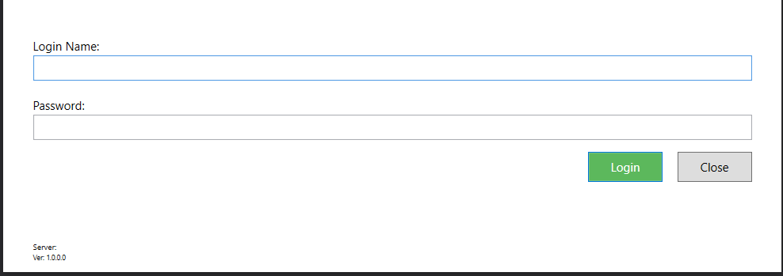
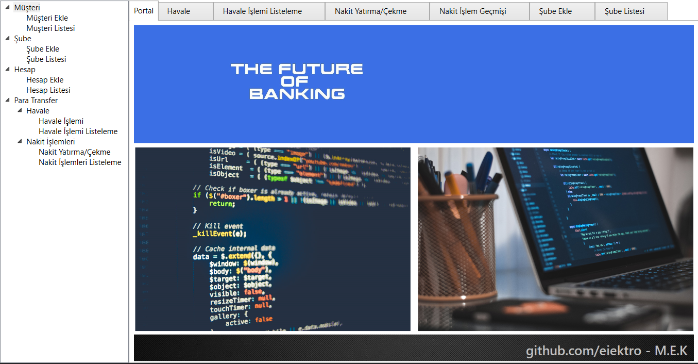

# Banking Project

This project includes digital implementations of core banking functions.
It has a structure that based on the principle of separation of concerns (SoC).

## Installation

Firstly,

` git clone https://github.com/eIektro/SoCBanking.git .

clone the repository by this line of code.

## Usage

This project depends on .NET Framework 4.6.1

You can install package from: [there](https://dotnet.microsoft.com/download/dotnet-framework/net461)

Then open .sln with Visual Studio -at least 2017-

## Contributing

PR free

## License

MIT

## Screenshoot

